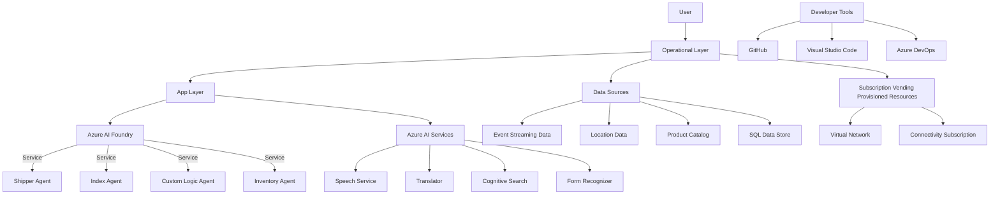

# Description:
The image depicts a high-level architecture diagram showcasing a system based on Azure components. Key entities and relationships include:

1. **User**: Represents an external entity interacting with the system.
2. **Operational Layer**: Contains foundational services such as Key Vault, Monitor, and Automation.
3. **App Layer**: Includes Azure AI Foundry, with components like Shipper Agent, Index Agent, Custom Logic Agent, and Inventory Agent.
4. **Azure AI Services**: Features various Azure services such as Speech Service, Translator, Cognitive Search, and Form Recognizer.
5. **Data Sources**: Includes external systems like Event Streaming Data, Location Data, Product Catalog, SQL Data Store, and others.
6. **Subscription Vending Provisioned Resources**:
   - Includes a virtual network and connectivity subscription with management groups and different connected services.
7. **Developer Tools**: Lists tools like Visual Studio Code, GitHub, and Azure DevOps.

### Mermaid Code:

This code approximates the hierarchical and relational structure shown in the diagram.
