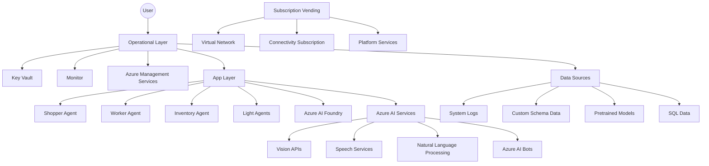

# Description:
The image shows a cloud-based architecture for an AI solution, emphasizing operational, data, and application layers, as well as subscription vending and network provisioning. Below is a conceptual representation using Mermaid code for the structural relationships:

This is a simplification of the architecture and may not contain every detail.
