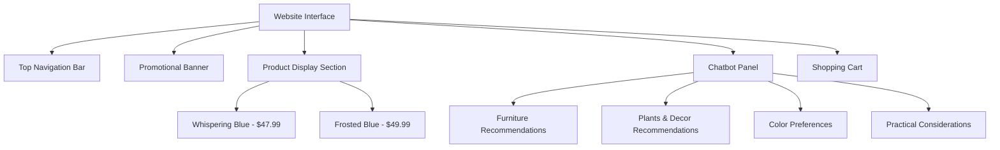

# Description:
The image shows an e-commerce website interface for shopping interior paints. Key elements are:

1. **Top Navigation Bar**: Logo, menu icons, "Sign Out" button.
2. **Promotional Banner**: Large visual showcasing summer-themed interior design and a discount offer (up to 50% off).
3. **Product Display Section**:
   - Two products: "Whispering Blue" and "Frosted Blue" with price tags.
4. **Chatbot Panel (Right Sidebar)**: Conversational assistant named "Cora" assisting with suggestions based on "Furniture," "Plants & Decor," "Color Preferences," and "Practical Considerations."
5. **Shopping Cart (Bottom Right)**: Empty cart details with subtotal.

