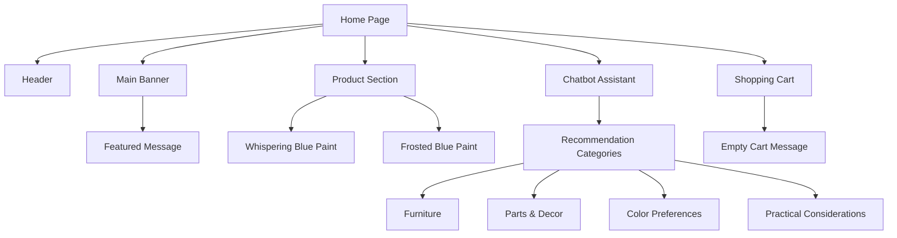

# Description:
The image appears to represent a user interface (UI) for an e-commerce or shopping platform centered around interior paints. It shows a navigation structure with categories like "Furniture," "Parts & Decor," "Color Preferences," and "Practical Considerations." There are product images (Whispering Blue, Frosted Blue) with prices and descriptions. On the right, a chatbot interface seems to be assisting the user with recommendations, and at the bottom, there's a shopping cart.

Mermaid code block representing the UI structure:

