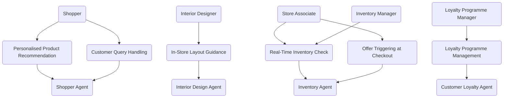

# Description:

```mermaid
graph TD
    A(Shopper) --> B(Personalised Product Recommendation)
    A --> C(Customer Query Handling)
    D(Interior Designer) --> E(In-Store Layout Guidance)
    F(Store Associate) --> G(Real-Time Inventory Check)
    F --> H(Offer Triggering at Checkout)
    I(Inventory Manager) --> G
    J(Loyalty Programme Manager) --> K(Loyalty Programme Management)

    B --> L(Shopper Agent)
    C --> L
    E --> M(Interior Design Agent)
    G --> N(Inventory Agent)
    H --> N
    K --> O(Customer Loyalty Agent)
```
