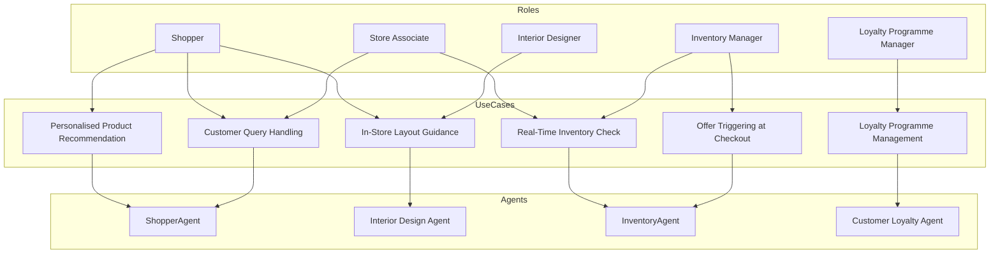

# Description:
Extracted content:

**Roles:**
- Shopper
- Interior Designer
- Store Associate
- Inventory Manager
- Loyalty Programme Manager

**Use Cases:**
- Personalised Product Recommendation
- Customer Query Handling
- In-Store Layout Guidance
- Real-Time Inventory Check
- Offer Triggering at Checkout
- Loyalty Programme Management

**Agents:**
- Shopper Agent
- Interior Design Agent
- Inventory Agent
- Customer Loyalty Agent

---

**Mermaid Code Block:**

